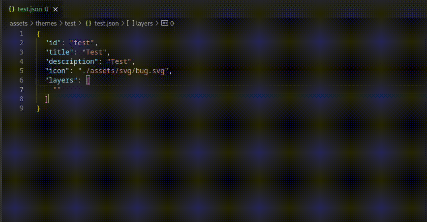

# MapCompleteVScode

This is a Visual Studio Code extension for [MapComplete](https://github.com/pietervdvn/MapComplete).
It adds autocompletion and defintion support for the MapComplete theme and layer configuration files.

Currently the following features are supported:

- Layers:
  - Autocompletion for the layer names
  - Definition support for the layer names
  - Implementation support for the layer names (showing where they are used)
- TagRenderings:
  - Autocompletion for _all_ tagRenderings
  - Definition support for tagRenderings
  - Implementation support for tagRenderings (showing where they are used)
- Filters:
  - Autocompletion for _all_ filters
  - Definition support for filters
  - Implementation support for filters (showing where they are used)
- Icons:
  - Autocompletion for icons
  - Definition support for icons
- Colours:
  - Support for colours in markers, lines and fills
- License info:
  - Definition support for paths in license_info.json files

Upon the first activation of this extension it will scan the workspace for all layers, tagRenderings and filters and cache them. This will take about 30 seconds, but the results are saved so they will only be updated when there are changes to the files. Alternatively, it is possible to manually update the cache by running the "MapComplete: Update cache" command.
It is also possible to deactivate the caching using setting `mapcomplete.caching`, but this will disable the implementation support, as well as the autocompletion for filters and tagRenderings that are not in the `filters.json` and `questions.json` files.



All notable changes to this project are documented in the [CHANGELOG](CHANGELOG.md) file.

## Installation

The extension can be installed in several ways:

### From the marketplace

The extension is available both in the [Visual Studio Code marketplace](https://marketplace.visualstudio.com/items?itemName=robin-van-der-linde.mapcompletevscode) and the [Open VSX registry](https://open-vsx.org/extension/robin-van-der-linde/mapcompletevscode).

So for both Visual Studio Code and VSCodium, you should just be able to search for "MapComplete" in the extensions tab and install it from there.

Alternatively you can press `Ctrl+P` and paste the following command:

```cmd
ext install robin-van-der-linde.mapcompletevscode
```

### From the .vsix file

You can also install the extension from the .vsix file. You can download the latest version from the [releases page](https://github.com/RobinLinde/MapCompleteVScode/releases). After downloading the .vsix file, you should be able to install it by going to extensions in Visual Studio Code and clicking on the three dots in the top right corner. Then click on "Install from VSIX..." and select the downloaded .vsix file.

It's also possible to install builds for any commit in any branch by checking out the workflow run for the commit you want to install, and downloading the .vsix file from the artifacts.

## Usage

Most of the features should be pretty self-explanatory. As for the implementation support, the 'anchor' for this is the id property of the layer, tagRendering or filter. This means that if you want to see where a layer is used, you should be able to see all uses by using `CTRL+F12` on the id property of the layer, or by right-clicking on the id property and selecting "Go to Implementations".
