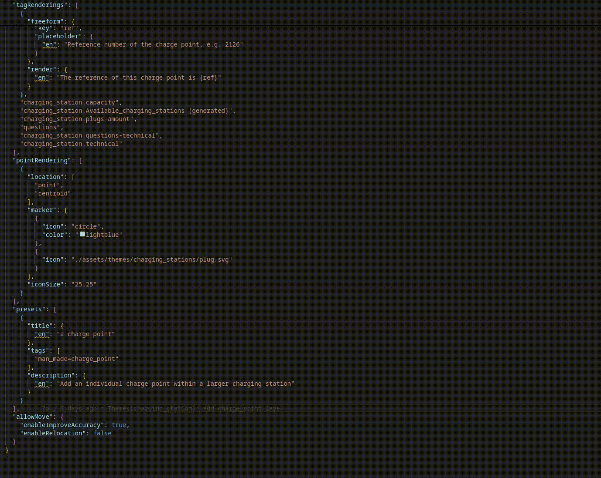

# MapCompleteVScode

This is a Visual Studio Code extension for [MapComplete](https://github.com/pietervdvn/MapComplete).
It adds autocompletion and defintion support for the MapComplete theme and layer configuration files.

Currently the following features are supported:

- Autocompletion for the layer names
- Definition support for the layer names
- Definintion support for icons
- Autocompletion for tagRenderings in questions.json
- Definition support for tagRenderings
- Autocompletion for filter keys in questions.json
- Definition support for filter keys
- Definition support for paths in license_info.json files
- Colour support for markers, lines and fills



All notable changes to this project are documented in the [CHANGELOG](CHANGELOG.md) file.

## Installation

The extension can be installed in several ways:

### From the Visual Studio Code marketplace

You can install this extension from the [Visual Studio Code marketplace](https://marketplace.visualstudio.com/items?itemName=robin-van-der-linde.mapcompletevscode). Just search for "MapComplete" and you should find it.

Alternatively you van press `Ctrl+P` and paste the following command:

```cmd
ext install robin-van-der-linde.mapcompletevscode
```

### From Open VSX

You can also install the extension from the [Open VSX registry](https://open-vsx.org/extension/robin-van-der-linde/mapcompletevscode). Just search for "MapComplete" and you should find it.

### From the .vsix file

You can also install the extension from the .vsix file. You can download the latest version from the [releases page](https://github.com/RobinLinde/MapCompleteVScode/releases). After downloading the .vsix file, you should be able to install it by going to extensions in Visual Studio Code and clicking on the three dots in the top right corner. Then click on "Install from VSIX..." and select the downloaded .vsix file.
